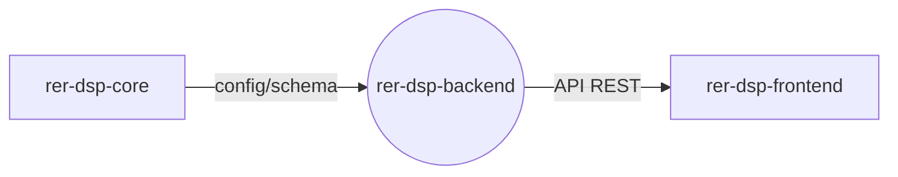

# rer-dsp-backend

> Este repositório é um dos módulos do **DSP (Data Sharing Platform)**, parte do ecossistema RER.
> A documentação completa do projeto está em **[rer-dsp-docs](https://github.com/Rural-Environmental-Registry/rer-dsp-docs)**.
> As informações abaixo tratam apenas deste módulo, não do projeto DSP como um todo.

## Qual parte do DSP este módulo é



## Objetivo

API REST que expõe dados ambientais e geoespaciais para compartilhamento entre
instituições parceiras do RER.

## Responsabilidades

- Expor endpoints REST para consulta e compartilhamento de dados
- Persistir e consultar dados geoespaciais (PostGIS)
- Ler a configuração de instalação gerada pelo `rer-dsp-core`

## Tecnologias

Java 21, Spring Boot 3.4.2, PostgreSQL/PostGIS, Gradle.

## Como executar

```bash
./gradlew bootRun
```

Ou, preferencialmente, via `rer-dsp-core` (`./start.sh`), que sobe toda a stack.

## Licença

[GNU General Public License v3.0](LICENSE)
